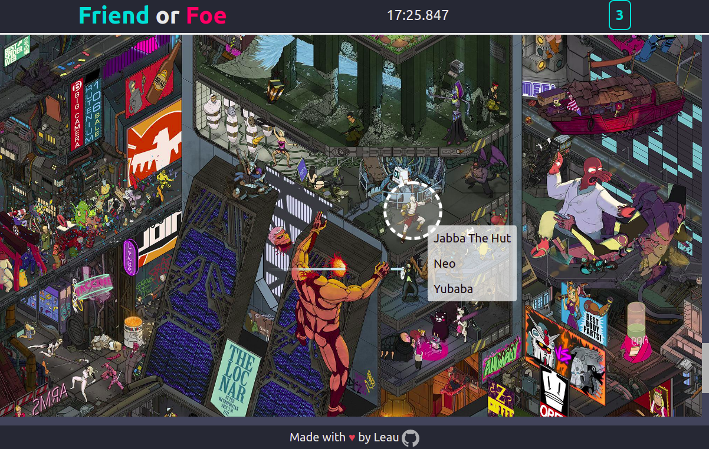
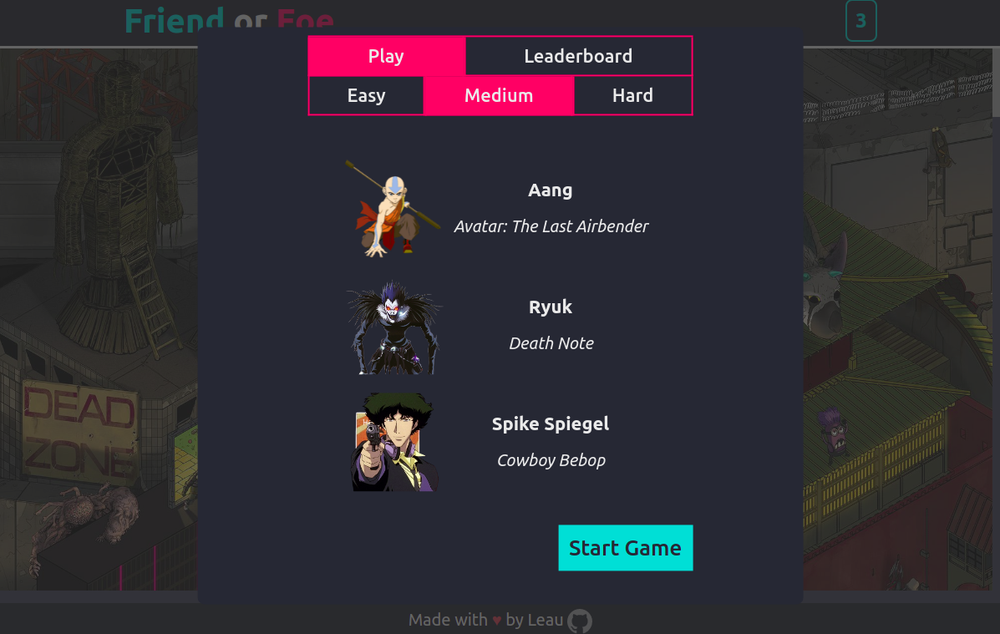
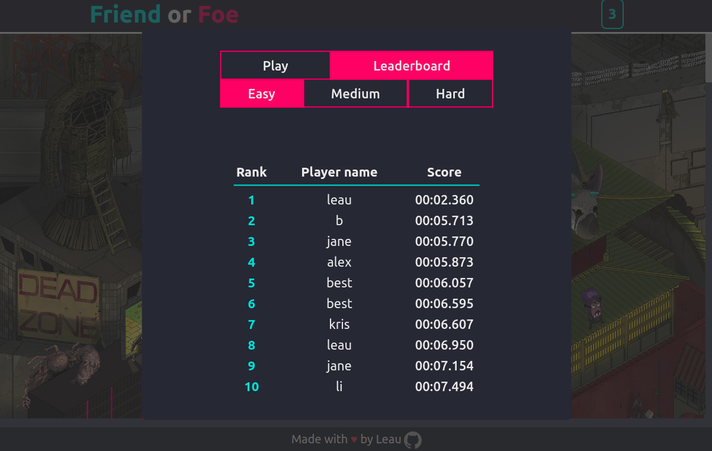
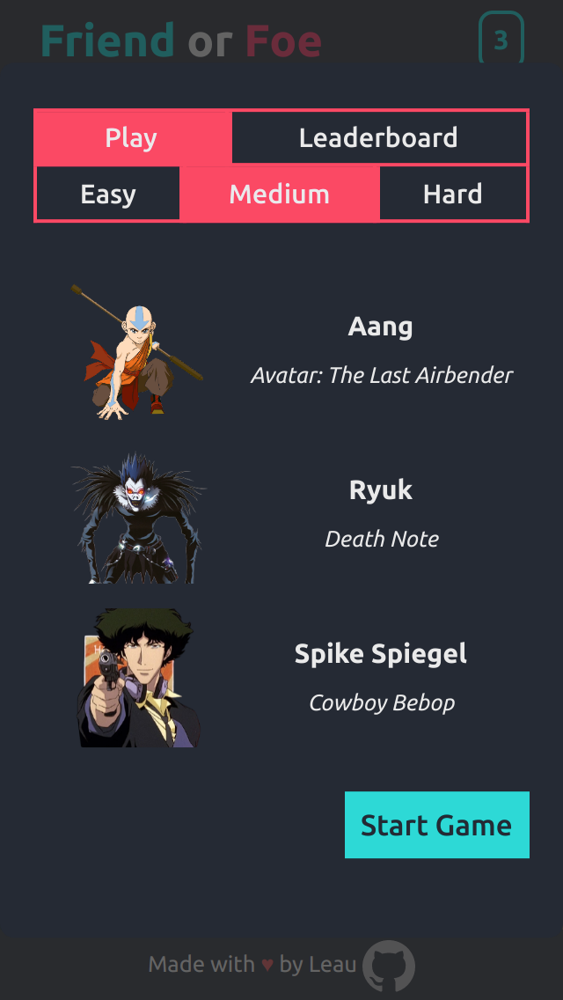
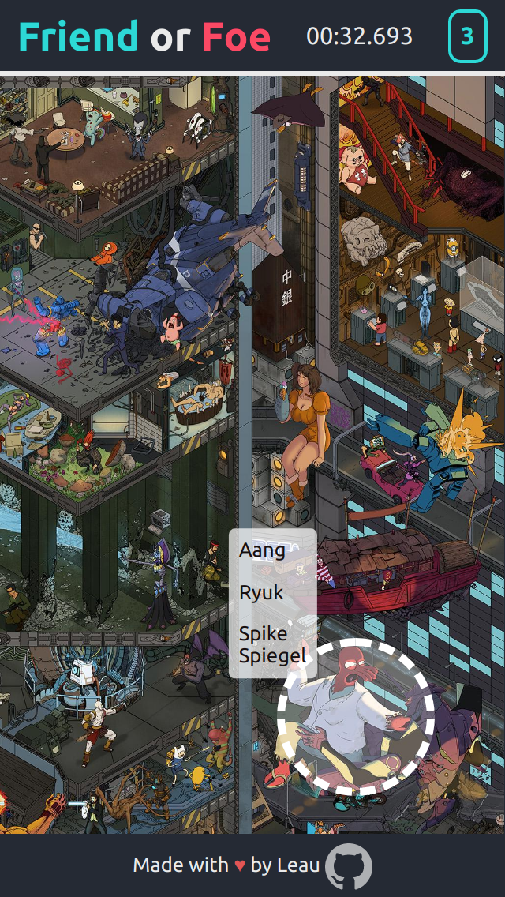
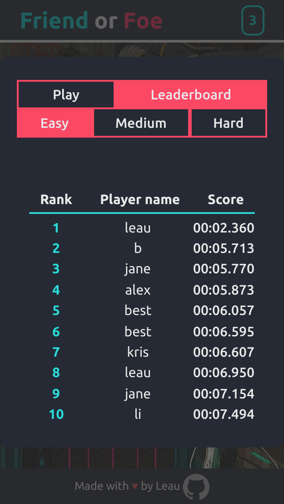

<div id="top"></div>
<h1 align="center">Friend or Foe</h1>

  <p align="center">
    A photo tagging game.
    <br />
    <br />
    <a href="https://leau-void.github.io/photo-tagging-app">Play</a>
    ·
    <a href="https://github.com/leau-void/photo-tagging-app/issues">Report Bug</a>
    ·
    <a href="https://github.com/leau-void/photo-tagging-app">Request Feature</a>
  </p>
</div>

## About The Project

[](https://leau-void.github.io/photo-tagging-app/)

<a href="#preview">More screenshots</a>

Friend or Foe is a photo tagging game, where players look through a very crowded picture to find familiar characters.


## Getting started

```
git clone https://github.com/leau-void/photo-tagging-app.git
cd photo-tagging-app
npm install
npm start
```

## Built With

- [React](https://reactjs.org/)
- [React Hooks](https://reactjs.org/docs/hooks-intro.html)
- [React Context API](https://reactjs.org/docs/context.html)
- [CreateReactApp](https://github.com/facebook/create-react-app/)
- [Firebase Auth](https://firebase.google.com/products/auth)
- [Cloud Firestore](https://firebase.google.com/products/firestore)
- [styled-components](https://styled-components.com/)
- [styled-icons](https://github.com/styled-icons/styled-icons)
- [My Custom Hooks](src/hooks/)
- [My custom hook for monitoring a component's rendered size](src/hooks/useElementSize.js)
- [Animate -- reusable React component I wrote for animating mounting and unmounting of components](src/utils/Animate.js)
- [Quicksort algorithm I wrote](src/utils/quickSort.js)


## Preview

### Desktop
<div align="center">
<a href="https://leau-void.github.io/photo-tagging-app/"></a>
<a href="https://leau-void.github.io/photo-tagging-app/"></a>
<a href="https://leau-void.github.io/photo-tagging-app/"></a>
</div>

### Mobile 
<div align="center">
<a href="https://leau-void.github.io/photo-tagging-app/"></a>
<a href="https://leau-void.github.io/photo-tagging-app/"></a>
<a href="https://leau-void.github.io/photo-tagging-app/"></a>
</div>

## Contact

Leau P - [LinkedIn](https://www.linkedin.com/in/leau-p) - lpierra@gmail.com

Project Link: [https://github.com/leau-void/photo-tagging-app](https://github.com/leau-void/photo-tagging-app)

<p align="right">(<a href="#top">back to top</a>)</p>

